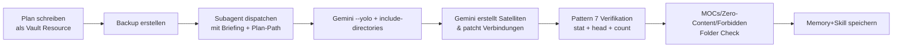

# Gemini CLI — Reference

`@google/gemini-cli` ist Googles offizielles Coding-Agent-CLI (Stand 2026-07-05: v0.49.0). Es konkurriert mit Claude Code/Codex/OpenCode, hat aber einen entscheidenden Unterschied: **Es kann via OAuth mit einem normalen Google-Account authentifiziert werden** und zieht dann das Kontingent aus einem bestehenden **Google AI Pro / Ultra Abo** — kein API-Billing, keine separaten Tokens.

## Install

```bash
npm i -g @google/gemini-cli
# Binary landet in ~/.nvm/versions/node/<v>/bin/gemini (oder /usr/local/bin wenn nicht via nvm)
```

## Zwei Auth-Modi

### A. OAuth (empfohlen, nutzt Google AI Pro Abo)

Wenn der User ein **Google AI Pro Abo** hat (€21.99/M, ehemals Gemini Advanced) → OAuth nutzen. **Achtung:** OAuth und API-Key schließen sich gegenseitig aus — der Modus wird in `~/.gemini/settings.json` festgenagelt:

```json
{
  "security": {
    "auth": {
      "selectedType": "oauth-personal"
    }
  }
}
```

OAuth-Client-Credentials (nicht geheim — die stehen in jeder installierten Gemini-CLI) liegen in `~/.gemini/.env` (mode 600):

```bash
GOOGLE_OAUTH_CLIENT_ID=...apps.googleusercontent.com
GOOGLE_OAUTH_CLIENT_SECRET=GOCSPX-...
```

**Wichtig: `GEMINI_API_KEY` darf NICHT gleichzeitig gesetzt sein** — die CLI priorisiert API-Key wenn beide vorhanden. Beim Wechsel auf OAuth also `GEMINI_API_KEY` aus `.env` entfernen.

### B. API-Key (Free-Tier / Pay-as-you-go)

```bash
echo "GEMINI_API_KEY=AIza..." > ~/.gemini/.env
chmod 600 ~/.gemini/.env
```

Auth-Typ in `settings.json` bleibt auf `gemini-api-key`. Eigener Key von https://aistudio.google.com/apikey. Free-Tier hat harte Rate-Limits; Paid-Tier wird separat über Google Cloud Billing abgerechnet.

## Login-Flow (OAuth)

### Variante 1: Browser öffnet automatisch (Default)

Im **User-Terminal** (nicht Hermes-Hintergrund):

```bash
gemini
# → Menü: "Sign in with Google" (Enter)
# → Browser öffnet sich automatisch
# → Google-Account auswählen → Consent bestätigen
# → CLI ist eingeloggt, unten rechts steht "Authenticated with ..."
```

### Variante 2: Headless / kein Browser (`NO_BROWSER=true`)

Für Server / SSH-Sessions:

```bash
NO_BROWSER=true gemini
# CLI druckt URL + wartet auf Code:
#   Please visit the following URL to authorize the application:
#   https://accounts.google.com/o/oauth2/v2/auth?...
#   Enter the authorization code:
# → URL im Browser öffnen, einloggen, Consent, Code kopieren, in CLI einfügen
```

**Code-Challenge ist zeitlich begrenzt (~5min) — zügig klicken.**

### ⚠️ OAuth-URL-Mangling-Falle (kritisch)

**Die OAuth-URL enthält `code_challenge` (43+ chars base64) und `state` (64 chars hex).** Wenn sie durch Render-Systeme geht (Chat-Output → Copy → Paste, Hermes-Terminal-Background, Browser-Adressbar-Autocomplete), gehen oft Zeichen verloren oder `%20` wird zu echtem Whitespace. **Symptom:** Google antwortet im Browser:

> "Die Anfrage kann vom Server nicht verarbeitet werden, da sie fehlerhaft ist. Senden Sie die Anfrage nicht noch einmal."

**Ursachen:**

1. Hermes-Terminal-Rendering mit `head -40` oder `cat` schneidet lange Lines an White-Spaces um → `code_challenge` truncated.
2. User copy-pastet aus Chat-Output wo `%20` evtl. decodiert dargestellt wurde.
3. `tail -15` killt Output vor dem URL.

**Fix:** URL **komplett aus dem User-Terminal** holen (nicht aus Hermes-Hintergrund), und in **einem Stück** markieren+kopieren. Alternative: User startet `gemini` selbst in seinem Terminal und macht den Browser-Schritt manuell.

### Auth-Credentials nach erfolgreichem Login

Gespeichert in `~/.gemini/google_accounts.json` (mode 600). Die CLI ist danach ohne weiteres Zutun eingeloggt, bis Token abläuft (~24h, dann re-login).

## Modi

### Print Mode (für Scripts / Batch)

```bash
gemini -p "Refactor src/auth.py to use async/await"
gemini -m gemini-2.5-flash -p "Quick smoke test: was macht die Funktion?"
```

**Wichtig: `-p` Mode hat KEINE Schreibwerkzeuge.** Gemini wird ehrlich sagen "I have no tools for this" — das ist kein Bug, sondern Design. Für Datei-Operationen → `--yolo` Mode (siehe unten).

**Vorteil ggü. Claude/Codex:** Kein `--allowedTools`, kein `--max-turns` Pflicht-Flags. Einfachster Coding-Agent-Aufruf der Library.

**Timeout-Setzung nötig:** Gemini 3.1 Pro Preview kann >90s für eine Antwort brauchen (reasoning-heavy). Mit `timeout 30-60` wrappen:

```bash
timeout 30 gemini -m gemini-2.5-flash -p "task"
```

### YOLO Mode (Schreibzugriff — `--yolo`)

`--yolo` aktiviert **write_file, replace, run_shell_command** im `-p`-Modus. Ohne dieses Flag sind alle Tool-Calls deaktiviert (read-only Chat).

```bash
# Datei schreiben (neue Datei)
gemini --yolo -m gemini-3.1-pro-preview -p "Write an ASCII architecture diagram to /tmp/arch.txt"

# Existierende Datei patchen
gemini --yolo -m gemini-2.5-flash -p "Add a Verantwortlichkeiten section to ~/Projekt/README.md"

# Besseres Beispiel mit Scope-Restriktion:
timeout 600 gemini --yolo \
  --include-directories "~/Dokumente/Obsidian Vault" \
  -m gemini-3.1-pro-preview \
  -p "Deine Task hier."
```

**Wichtige Eigenschaften:**
- `--yolo` = auto-approve ALLE Tools. Gemini entscheidet selbstständig wann es schreibt.
- `--include-directories <pfad>` = Sicherheits-Scope. Damit Gemini NUR Dateien in diesem Pfad bearbeiten darf.
- **Ohne `--include-directories`** = Gemini kann JEDE Datei auf dem System lesen/schreiben. Immer setzen.
- Abbrechen wenn Gemini eine Regel verletzt: `timeout`-Wrapper fängt hängende Prozesse.
- Verifikation nach dem Run: Pattern 7 (stat + head-Checks auf jede behauptete Änderung).

**Tool-API von Gemini im YOLO-Mode (2026-07-05 live getestet):**
| Tool | Funktion | Sicherheits-Level |
|---|---|---|
| `run_shell_command` | Shell-Befehle ausführen | 🔴 Höchstes Risiko (kann alles) |
| `write_file` | Neue Datei erstellen | 🟡 Mittel (überschreibt nicht existierende) |
| `replace` | Existierende Datei patchen (find+replace) | 🟢 Niedrig (additive Änderung) |

### Interactive Mode (TUI)

```bash
gemini      # startet TUI mit `>`-Prompt, Slash-Commands, File-Picker (@path/to/file)
```

Slash-Commands: `/help`, `/model`, `/auth`, `/quit`. Model-Wechsel über `/model` (unten rechts in der Status-Bar). TUI braucht zwingend echtes TTY — Hermes-Background-Terminal hat keins, im User-Terminal aber problemlos.

### Sandbox-Mode

Default: `no sandbox`. Datei-Operations auf dem ganzen Filesystem möglich. Code-Execution erlaubt. Für Production-Sandboxing siehe `--sandbox` Flag (YOLO-Mode = `Ctrl+Y` in der TUI).

### Vault-Worker Subagent Pattern (Obsidian + Gemini)

**Pattern:** Yuno (Queen) → Subagent (MiniMax-M3 Worker-Biene) → Gemini-CLI als Tool

**Wann:** Vault mit Cross-Links + Satelliten-Notes anreichern. Gemini ist ideal weil:
- 1M Context erfasst kompletten Vault in einem Durchgang
- Reasoning-Modell (3.1 Pro) erkennt thematische Lücken (Pattern 6 Improvisation)
- Respektiert Anti-Pattern-Listen präzise (2026-07-05 getestet: 0/7 Regeln verletzt)
- Meldet ehrlich wenn's nicht geht → kein Halluzinations-Risiko

**Workflow (8 Schritte):**



**Schritt-für-Schritt:**

1. **Plan als Vault-Resource** (`05 Ressourcen/Vault-Phase-N-Plan.md`) mit Scope, Anti-Patterns, Ziel-Metriken
2. **Backup:** `cp -a "$VAULT" "~/.cache/vault-backups/phaseN-$(date +%Y%m%d_%H%M%S)/"`
3. **Subagent dispatchen** mit:
   - Plan-File-Pfad zum Lesen
   - Gemini-Befehl mit `--yolo --include-directories "$VAULT" -m gemini-3.1-pro-preview`
   - Anti-Pattern-Liste + verbotene Folder + Zero-Content-Notes
   - Pattern-7-Verifikation nach Run
4. **Gemini-CLI** erstellt Satelliten-Notes + patcht additive "Verbindet zu"-Sektionen
5. **Pattern 7:** `stat --format=%s` auf jede neue Note (muss > 100B), `head -20` auf 3+ gepatchte Files
6. **Regel-Check:** `find` auf verbotene Folder → muss 0 sein. Zero-Content unverändert → `stat` zeigt 0B
7. **Post-Metriken:** Notes-Anzahl, avg Links/Note, Orphans (0 outgoing), MOC-Dichte
8. **Memory** + Skill patchen

**Konkreter Subagent-Dispatch (Python-artig):**
```python
delegate_task(
    goal="Vault-Schreibzugriff mit Gemini --yolo (Phase N)",
    context=f'''Plan lesen: cp -a $VAULT backup && timeout 600 \
      gemini --yolo --include-directories "$VAULT" \
      -m gemini-3.1-pro-preview \
      -p "$(cat $PLAN_FILE)\n\n---\nZUSÄTZLICHER AUFTRAG UND REGELN: ..."
    Verifikation nachher: stat, head, diff Metriken''',
    role="leaf"
)
```

**Bekannte Ergebnisse (2026-07-05 Phase 7):**
| Metrik | Vorher | Nachher | Δ |
|---|---|---|---|
| Notes | 116 | 118 | +2 Satelliten |
| Avg Links/Note | ~9.0 | 10.97 | +1.97 |
| Orphans (0 links) | 2 | 2 | Nur Zero-Content |
| MOCs patched | — | 0 | ✅ Regel eingehalten |
| Verbotene Folder | — | 0 | ✅ Alle 7 clean |
| Halluzinationen | — | 0 | ✅ Ehrliche Gap-Analyse |

**Anti-Patterns:**
- ⚠️ `--yolo` ohne `--include-directories` = voller Root-Zugriff. Immer setzen.
- ⚠️ Subagent muss Pattern-7-Verifikation **immer** machen — Gemini gibt selbst-report, nicht blind vertrauen.
- ⚠️ MOCs nie von Gemini patchen lassen (Königs-Domain).
- ⚠️ timeout 600 setzen — 3.1 Pro braucht Zeit für Schreiboperationen.
- ⚠️ Backup VOR dem Run — Gemini mit `--yolo` + `run_shell_command` kann theoretisch system-weite Änderungen machen (auch wenn es das praktisch nie tut).

**Siehe auch:**
- `vault-architecture` skill — Phase 7 Plan + Verifikation
- `coding-agents/SKILL.md` — Gemini CLI section
- `05 Ressourcen/Vault-Phase-7-Plan - Gemini-Audit.md` (vault resource) — worked example

## Modelle

| Model | Context | Speed | Use Case |
|---|---|---|---|
| `gemini-2.5-flash` | 1M | ⚡ schnell | Default, smoke-tests, Bulk |
| `gemini-2.5-pro` | 1M | mittel | Coding, Refactoring |
| `gemini-3.1-pro-preview` | 1M | 🐌 langsam, reasoning-heavy | Komplexe Synthese, hardest tasks |

**Mit Google AI Pro Abo:** alle drei verfügbar (TUI zeigt sie im `/model`-Menü). Free-Tier hat oft nur Flash.

## Pitfalls

1. **OAuth-URL-Mangling** (siehe oben) — kritischster Pitfall. Immer im User-Terminal.
2. **`GEMINI_API_KEY` blockiert OAuth** — beim Wechsel auf OAuth-Login den Key aus `~/.gemini/.env` entfernen, sonst priorisiert die CLI den Key und OAuth wird nie versucht.
3. **`settings.json` auth.selectedType** — `gemini-api-key` vs `oauth-personal` vs `vertex-ai`. Default ist `gemini-api-key`. Ohne gesetzten Key hängt die CLI stumm oder bekommt 400.
4. **`NO_BROWSER=true` ohne `pty=true`** — `head -40` und `tail -15` killt sie mit "non-interactive" Fehler. Muss interaktiv gestartet werden (PTY-echt oder User-Terminal).
5. **Pro-Preview-Modelle langsam** — >90s für manche Antworten möglich. `timeout` setzen oder mit Flash smoke-testen.
6. **TUI `Enter`-Taste im Hermes-Terminal** — sendet statt Enter oft nur Whitespace (Ctrl+V etc. nötig). Im User-Terminal kein Problem. Für Hermes-Tests lieber `-p`-Mode.
7. **API-Key-Sicherheit** — Key im Chat pasten = leaked. Per `nano ~/.gemini/.env` eintragen, nicht im Tool-Call.
8. **Mode-Konflikt bei Settings-Edit** — `settings.json` muss vor dem ersten CLI-Start passen, sonst kommt entweder Auth-Loop oder "API_KEY_INVALID".
9. **Code Assist API ist deprecated (Stand 2026-07-05)** — OAuth-Login auf `oauth-personal` antwortet inzwischen mit "This client is no longer supported for Gemini Code Assist for individuals. To continue using Gemini, please migrate to the Antigravity suite of products: https://antigravity.google". **Workaround für jetzt:** API-Key-Mode (`selectedType: gemini-api-key`) funktioniert weiterhin. OAuth-Token wird zwar in `~/.gemini/oauth_creds.json` gespeichert, kann aber nicht gegen Code-Assist-API eingelöst werden bis Antigravity-Migration abgeschlossen ist.
10. **Routing zeigt "gemini-3.5-flash" als Default** — die TUI listet die verfügbaren Modelle; `-m` Override funktioniert mit allen Standard-Namen (`gemini-2.5-flash`, `gemini-2.5-pro`, `gemini-3.1-pro-preview`).
11. **Nicht-kritischer Telemetrie-Error** — `Error flushing log events: HTTP 400: Bad Request` im Debug-Mode ist Log-Reporting an Google (Usage-Stats), keine Auswirkung auf Funktionalität. Ausschalten mit `DISABLE_TELEMETRY=1` in `~/.gemini/.env`.
12. **OAuth-Fallback trotz API-Key-Mode (silent, 2026-07-05)** — Die CLI hat eine Auth-Priorität, die nirgends offiziell dokumentiert ist:
    1. `GEMINI_API_KEY` in `~/.gemini/.env` (wenn gesetzt, unabhängig vom Mode)
    2. `access_token` in `~/.gemini/oauth_creds.json` (Fallback wenn kein Key — funktioniert AUCH im `gemini-api-key`-Mode!)
    3. Fail mit `API_KEY_INVALID` (HTTP 400)

    **Implikation:** Wenn du `settings.json` auf `gemini-api-key` schaltest um "sicher zu gehen" dass der Key benutzt wird, der User aber gleichzeitig einen alten OAuth-Token auf der Platte hat (`oauth_creds.json`), läuft die CLI trotzdem via OAuth — silent. Effektive Auth prüfen mit `bash ~/.hermes/scripts/gemini-smoke.sh` (das Script liest beide Quellen). Erzwingen von Key-only: `oauth_creds.json` löschen ODER OAuth-Zeilen aus `.env` entfernen + Token-File weg.

## Smoke-Test nach Login

```bash
# Schnell (Flash, <10s):
timeout 30 gemini -m gemini-2.5-flash -p "Sag in einem Satz auf Deutsch: Welches Modell bist du?"

# Schwer (Pro, kann 60s+ dauern):
timeout 120 gemini -m gemini-3.1-pro-preview -p "Refactor: schreib eine Python-Funktion die fizzbuzz als Liste returnt."

# Erfolg = eine sinnvolle Antwort kommt zurück ohne 4xx/5xx
# Failure-Modi:
#   - 400 API_KEY_INVALID → Key prüfen / neu generieren
#   - "non-interactive" → NO_BROWSER-Mode im User-Terminal
#   - Timeout → Pro-Preview-Modell, mit Flash nochmal
```

## File-Pattern für Vergleich mit Claude/Codex/OpenCode

| Feature | Claude Code | Codex | OpenCode | Gemini CLI |
|---|---|---|---|---|
| Print-Mode | `claude -p` | `codex exec` | `opencode run` | `gemini -p` |
| Interactive | `claude` (PTY) | `codex --interactive` | `opencode` (PTY) | `gemini` (PTY) |
| OAuth möglich | ✓ (Pro-Plan, 5h-Limit) | ✗ | ✗ | ✓ (Google AI Pro Abo) |
| API-Key | ✓ (Anthropic) | ✓ (OpenAI) | ✓ (any) | ✓ (Google AI Studio) |
| `--max-turns` | ✓ | ✗ | ✓ | ✗ (default unlimited) |
| Sandbox | `--permission-mode` | `--full-auto` | `--sandbox` | `--sandbox` (limited) |
| MCP | ✓ `claude mcp add` | ✓ | ✓ | ✓ `gemini mcp add` |
| Bild-Input | ✓ | ✓ | ✓ | ✓ (multimodal stark) |
| Bash-Mode | `!` | via `--full-auto` | `!` | `!` |
| Brand-New Auth-Setup | `claude login` (OAuth) | `codex login` (ChatGPT) | provider-specific | `gemini` (Google-Account) |

## Verwandte Skills

- **`coding-agents/SKILL.md`** — Übersicht aller Coding-Agent-CLIs
- **`nous-multi-lane-routing`** — Gemini als zusätzliche Free-Lane (Pro-Abo-Kontingent)
- **`hermes-admin`** — `~/.gemini/`-Pfad-Konventionen und Permission-Mode