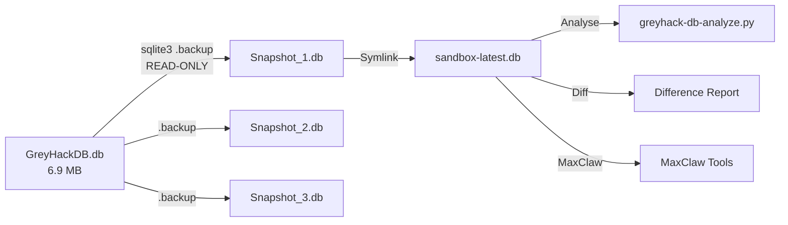

# GreyHack DB Snapshot & Analyse — Systemdokumentation

> **📌 Historischer Stand (2026-07-04).** Die MaxClaw-Runtime wurde am 2026-07-07 auf **OpenClaw** migriert (Config: `config/openclaw.json` + `exec-approvals.json`, siehe README). Referenzen unten auf `hermes …`, `~/.hermes/` oder `config.yaml` beschreiben den damaligen Stand und werden bewusst nicht rückwirkend umgeschrieben.

**Datum:** 2026-07-04
**Autor:** Hermes Agent / MaxClaw Projekt
**Status:** ✅ Aktiv

---

## 1. Übersicht

Dieses Dokument beschreibt den vollständigen **Sandbox-Snapshot-Workflow** für die GreyHack-Datenbank (`GreyHackDB.db`). Das System besteht aus drei Komponenten:

| Komponente | Pfad | Typ |
|---|---|---|
| Cron-Workflow | `maxclaw-clone/workflows/greyhack-db-snapshot.md` | Workflow-Definition |
| Snapshot-Skript | `~/bin/greyhack-db-snapshot.sh` | Bash (ausführbar) |
| Analyse-Skript | `~/bin/greyhack-db-analyze.py` | Python 3 (CLI) |

**Prinzip:** Die GreyHack-DB wird NIE direkt beschrieben. Alle Operationen arbeiten auf READ-ONLY-Kopien (`.backup` via `sqlite3 -readonly`). Der Workflow folgt dem **Watchdog-Pattern**: still bei Erfolg, Alarm bei Anomalie.

---

## 2. Datenbank-Strukturanalyse

### 2.1 Allgemein

| Eigenschaft | Wert |
|---|---|
| Pfad | `/mnt/DATA/Programme/Steam/steamapps/common/Grey Hack/Grey Hack_Data/GreyHackDB.db` |
| Grösse | 6,979,584 Bytes (~6.66 MB) |
| Engine | SQLite 3.45.1 |
| Tabellen | 18 |
| Foreign Keys | **Keine** (PRAGMA foreign_keys = 0, keine foreign_key_list-Einträge) |
| Spielzeit (Clock) | `2000-01-06T13:58:58` (in-game) |
| Seed | `-1665370662` |

### 2.2 Tabellen und Row-Counts

| Table | Rows | Beschreibung |
|---|---|---|
| **Players** | 1 | Spieler-Charakter (PlayerID: `e85129e9ae28753542b97bf10378c645`) |
| **Computer** | 18 | 1x IsPlayer=1, 15x IsRouter=1, 2x Standard |
| **Files** | 248 | Datei-Content + refCount |
| **Map** | 56 | IPs, BSSID, AccessType, Missionen |
| **WebPages** | 48 | Gehostete Webseiten (PublicIp, LocalIp) |
| **Passwords** | 267 | Passwort-Hashes (plaintext-MD5-ähnlich, 4-6 Zeichen) |
| **Logs** | 21 | Log-Einträge |
| **BankAccounts** | 4 | User + Transactions (JSON) |
| **MailAccounts** | 7 | User + Mails (JSON) |
| **InfoGen** | 1 | Globale Spielkonfiguration |
| **Coins** | 0 | (leer) |
| **Stocks** | 0 | (leer) |
| **Wallets** | 0 | (leer) |
| **CTFs** | 0 | (leer) |
| **SharedConns** | 0 | (leer) |
| **PlayerConns** | 0 | (leer) |
| **BackupPlayers** | 0 | (leer) |
| **BackupPlayerFiles** | 0 | (leer) |

### 2.3 Tabellen-Schemata (vollständig)

#### Players (1 Row)
```sql
CREATE TABLE Players (
    ComputerID          TEXT,           -- FK-ähnlich zu Computer.ID (kein explizites FK)
    PlayerID            TEXT PRIMARY KEY,
    infoMapX            REAL,
    infoMapY            REAL,
    indMap              INTEGER,
    Storage             TEXT DEFAULT '',
    GameOver            INTEGER DEFAULT 0,
    Nickname            TEXT DEFAULT '',
    TutoData            TEXT DEFAULT '',
    Missions            TEXT DEFAULT '',     -- JSON-Array
    LastConnection      TEXT,                -- ISO 8601
    WalletID            TEXT DEFAULT '',
    WalletPass          TEXT DEFAULT '',
    MissionsCooldown    TEXT DEFAULT '',
    CTFCooldown         TEXT DEFAULT '',
    RentalsInfo         TEXT DEFAULT '',
    StocksInfo          TEXT DEFAULT '',
    LoginData           TEXT DEFAULT '',      -- JSON
    ShopHardware        longtext NOT NULL,    -- JSON
    BankUser            TEXT DEFAULT '',
    ZeroDayRequest      longtext DEFAULT '',  -- JSON
    BankTraces          TEXT DEFAULT '',
    TLCooldown          TEXT DEFAULT '',
    TokenTrace          TEXT DEFAULT '',
    PassiveTraces       TEXT DEFAULT '',
    GuiLaunchCooldown   TEXT DEFAULT ''
);
```

#### Computer (18 Rows)
```sql
CREATE TABLE Computer (
    FileSystem  TEXT,           -- JSON: Dateisystem-Baum
    Hardware    TEXT,           -- JSON: Hardware-Konfiguration
    IsRouter    INTEGER,        -- 0/1
    IsPlayer    INTEGER,        -- 0/1 (genau einer ist 1)
    IsRented    INTEGER,        -- 0/1
    Users       TEXT,           -- JSON: Benutzerkonten
    ConfigOS    TEXT,           -- JSON: OS-Konfiguration
    Procs       TEXT,           -- JSON: Prozesse
    IsCTF       INTEGER,        -- 0/1
    ID          TEXT PRIMARY KEY  -- IP:Port oder UUID beim Player
);
```

#### Files (248 Rows)
```sql
CREATE TABLE Files (
    ID          TEXT PRIMARY KEY,
    Content     TEXT,
    refCount    INTEGER NOT NULL DEFAULT 1
);
```

#### Map (56 Rows)
```sql
CREATE TABLE Map (
    posX                REAL,
    posY                REAL,
    Bssid               TEXT,       -- MAC-Adresse
    Essid               TEXT,       -- SSID
    ID                  TEXT,
    WebAddress          TEXT,
    TipoRed             INTEGER,    -- Netzwerktyp (1,8,10,12,14)
    Seed                INTEGER,
    Mission             TEXT DEFAULT '',
    IpAddress           TEXT PRIMARY KEY,
    AccessType          INTEGER,    -- Zugangstyp (1=öffentlich)
    LibVersions         TEXT,       -- JSON: Bibliotheksversionen
    generateds          TEXT DEFAULT '',
    MissionNpcNames     TEXT,
    Date                INTEGER,
    GenerationProfile   INTEGER DEFAULT 0
);
Indices: idxEbssid(Bssid,Essid), idxWebAddress(WebAddress), idx_posXY(posX,posY)
```

#### BankAccounts (4 Rows)
```sql
CREATE TABLE BankAccounts (
    Transactions    TEXT,       -- JSON-Array
    User            TEXT PRIMARY KEY,
    Password        TEXT
);
```

#### MailAccounts (7 Rows)
```sql
CREATE TABLE MailAccounts (
    Mails       TEXT,       -- JSON-Array
    User        TEXT PRIMARY KEY,
    password    TEXT
);
```

#### WebPages (48 Rows)
```sql
CREATE TABLE WebPages (
    Web             TEXT,       -- HTML/Inhalt
    ExternalPort    INTEGER,
    PublicIp        TEXT,
    LocalIp         TEXT,
    Address         TEXT,
    TypeNet         INTEGER,
    NumVisits       INTEGER DEFAULT 0,
    DateCreation    INTEGER DEFAULT 0,
    PRIMARY KEY(PublicIp, LocalIp)
);
Indices: idxTypeNet(TypeNet), idxNumVisits(NumVisits), idxDateCreation(DateCreation), idxAddress(Address)
```

#### Passwords (267 Rows)
```sql
CREATE TABLE Passwords (
    ID              TEXT PRIMARY KEY,
    PlainPassword   TEXT      -- 4-6 Zeichen Klartext
);
```

#### Logs (21 Rows)
```sql
CREATE TABLE Logs (
    ID      TEXT PRIMARY KEY,
    Log     TEXT
);
```

#### InfoGen (1 Row)
```sql
CREATE TABLE InfoGen (
    Seed                INTEGER,
    VersionsControl     TEXT,     -- JSON
    Exploits            TEXT DEFAULT '',
    Guilds              TEXT,     -- JSON
    Clock               TEXT,     -- ISO 8601
    DeleteVersion       INTEGER,
    AllLibs             TEXT DEFAULT '',
    Invoices            TEXT DEFAULT '',
    GlobalMoney         TEXT,     -- JSON
    ZeroDaySystem       TEXT      -- JSON
);
```

#### Coins / Stocks / Wallets / CTFs (alle leer)
```sql
CREATE TABLE Coins (CoinName TEXT PRIMARY KEY, CoinContent TEXT, OwnerPlayerID TEXT, WebAddress TEXT DEFAULT '');
CREATE TABLE Stocks (Id INTEGER PRIMARY KEY AUTOINCREMENT, IpAddress TEXT UNIQUE, StocksContent TEXT, points INTEGER);
CREATE TABLE Wallets (WalletID TEXT PRIMARY KEY, WalletContent TEXT);
CREATE TABLE CTFs (EventName TEXT PRIMARY KEY, EventContent TEXT, OwnerPlayerID TEXT);
```

#### SharedConns / PlayerConns (leer)
```sql
CREATE TABLE SharedConns (ComputerID TEXT PRIMARY KEY, Players TEXT);
CREATE TABLE PlayerConns (ComputerID TEXT PRIMARY KEY, RouterID TEXT, LocalIp TEXT);
```

#### BackupPlayers / BackupPlayerFiles (leer)
```sql
CREATE TABLE BackupPlayers (ID TEXT PRIMARY KEY, FileSystem TEXT, IsRouter INTEGER, Users TEXT, ConfigOS TEXT, Hardware TEXT);
CREATE TABLE BackupPlayerFiles (ID TEXT PRIMARY KEY, Content TEXT, RouterID TEXT);
CREATE INDEX idxRouterID ON BackupPlayerFiles(RouterID);
```

### 2.4 Foreign-Key-Beziehungen (logisch, nicht in DB definiert)

Die DB hat **keine expliziten Foreign Keys** (PRAGMA foreign_keys = 0). Dennoch existieren logische Beziehungen:

| Quelle | Ziel | Beziehung |
|---|---|---|
| `Players.ComputerID` | `Computer.ID` | Jeder Spieler gehört zu genau einem Computer |
| `Players.WalletID` | `Wallets.WalletID` | Spieler kann ein Wallet besitzen |
| `Coins.OwnerPlayerID` | `Players.PlayerID` | Coins gehören einem Spieler |
| `CTFs.OwnerPlayerID` | `Players.PlayerID` | CTF-Events gehören einem Spieler |
| `Computer.ID` | `Map.IpAddress` | Computer-IDs folgen Map-IPs (Format `IP:Port`) |
| `Passwords.ID` | `Files.ID` | Passwort-IDs referenzieren File-IDs (MD5-ähnlich) |
| `Logs.ID` | `Files.ID` | Log-IDs referenzieren File-IDs |
| `PlayerConns.ComputerID` | `Computer.ID` | Verbindung zwischen Player und Router |
| `PlayerConns.RouterID` | `Computer.ID` | Router-ID |
| `SharedConns.ComputerID` | `Computer.ID` | Geteilte Verbindungen |
| `BackupPlayerFiles.RouterID` | `Computer.ID` | Backup-Router-Zuordnung |
| `MailAccounts.User` | (extern) | E-Mail-Adressen (@domain) für NPCs/Spieler |
| `BankAccounts.User` | `Players.BankUser` | Bank-User kann zum Spieler gehören |

### 2.5 Aktueller Player-State (gesnapshotet)

```json
{
  "player_id":  "e85129e9ae28753542b97bf10378c645",
  "computer_id":"171a9e0f-f9f9-4d76-8f37-d125d3f3e181",
  "nickname":   "(leer — noch nicht gesetzt)",
  "game_over":  false,
  "missions_bytes": 173,
  "shop_hardware_bytes": 33,
  "login_data": true,
  "last_connection": "2000-01-06T13:58:58",
  "bank_user":  "(leer)"
}
```

---

## 3. Sandbox-Snapshot-Workflow

### 3.1 Konzept "Sandbox"

Ein **Sandbox-Snapshot** ist eine atomare READ-ONLY-Kopie der GreyHack-DB.
MaxClaw (und alle Analyse-Tools) arbeiten NUR auf der Kopie — das Original wird
nie beschrieben.



### 3.2 Cron-Workflow (`greyhack-db-snapshot.md`)

- **Typ:** Cron-Job (Hermes)
- **Schedule:** `0 */6 * * *` (alle 6 Stunden)
- **Modell:** `heartbeat` (billig)
- **Deliver:** Telegram (nur bei Anomalie)
- **Skills:** `greyhack`
- **Workflow-Datei:** `maxclaw-clone/workflows/greyhack-db-snapshot.md`

**Registrierung:**
```bash
cd /tmp/maxclaw-clone
./workflows/register-workflows.sh
```

Oder manuell:
```bash
hermes cron create "0 */6 * * *" "$(cat workflows/greyhack-db-snapshot.md)" \
  --name greyhack-db-snapshot \
  --deliver telegram:7222661188 \
  --skill greyhack
```

### 3.3 Snapshot-Skript (`greyhack-db-snapshot.sh`)

**Pfad:** `~/bin/greyhack-db-snapshot.sh` (ausführbar)

**Usage:**
```bash
# Normallauf (Watchdog: silent on success)
~/bin/greyhack-db-snapshot.sh

# Dry-Run (mit Output — für Tests)
~/bin/greyhack-db-snapshot.sh --dry-run

# Force (immer Output erzwingen)
~/bin/greyhack-db-snapshot.sh --force
```

**Ablauf (Normallauf):**
1. Prüft Voraussetzungen (sqlite3, DB-Pfad)
2. Misst Original-DB-Grösse
3. Findet letzten Snapshot für Diff-Basis
4. **Prüft Grössen-Trend** (Anomalie wenn >20% Sprung)
5. **Erzeugt Snapshot:** `sqlite3 -readonly $DB .backup $SNAPSHOT` (atomar, konsistent)
6. **Aktualisiert Symlink:** `sandbox-latest.db → neuester Snapshot`
7. **Rotation:** Löscht älteste Snapshots, behält max 7
8. **Diff-Analyse:** Cross-DB-Vergleich via `ATTACH DATABASE`
9. **Anomalieerkennung:** Neue Computer, neue Player, neue Banken
10. **Grössen-Log:** `~/backups/greyhack/size-history.csv`
11. **Exit-Code:** 0 (ok/silent), 1 (Anomalie/Alarm)

**Watchdog-Pattern:**
- Normallauf ohne Änderungen: **kein Output, exit 0**
- Bei Anomalie: **Report auf stderr, exit 1** (Cron registriert Alarm)

**Snapshot-Pfad:** `~/backups/greyhack/GreyHackDB_YYYYMMDD_HHMMSS.db`
**Sandbox-Link:** `~/backups/greyhack/sandbox-latest.db`
**Rotation:** Letzte 7 Snapshots (~48 MB max)

### 3.4 Analyse-Skript (`greyhack-db-analyze.py`)

**Pfad:** `~/bin/greyhack-db-analyze.py` (ausführbar)

**Usage:**
```bash
# Zusammenfassung (Default)
~/bin/greyhack-db-analyze.py ~/backups/greyhack/sandbox-latest.db --summary

# Vollständiges JSON
~/bin/greyhack-db-analyze.py ~/backups/greyhack/sandbox-latest.db --json

# Formatiertes JSON
~/bin/greyhack-db-analyze.py ~/backups/greyhack/sandbox-latest.db --json --pretty

# Nur Player-State
~/bin/greyhack-db-analyze.py ~/backups/greyhack/sandbox-latest.db --player-only

# In Datei schreiben
~/bin/greyhack-db-analyze.py ~/backups/greyhack/sandbox-latest.db --json -o analyse.json
```

**Analyse-Bereiche (ClamAV-artig):**
| Bereich | Beschreibung | Datenquelle |
|---|---|---|
| `player` | Spieler-State: Nickname, GameOver, Missions, Wallet, BankUser | Players + Computer |
| `computers` | Alle Computer + Typ (Player/Router/CTF/Rented) | Computer |
| `bank_accounts` | Bankkonten + Transaktionsanzahl + Detail | BankAccounts |
| `mail_accounts` | Mail-Konten + Mail-Anzahl + Detail | MailAccounts |
| `passwords` | Passwort-IDs (mit Sample) | Passwords |
| `network_map` | IPs, BSSID, AccessType, Typ-Verteilung | Map |
| `web_pages` | Webseiten + Visits | WebPages |
| `files` | Datei-Statistiken | Files |
| `logs` | Log-Einträge | Logs |
| `economy` | Coins, Stocks, Wallets | Coins/Stocks/Wallets |
| `ctfs` | CTF-Events | CTFs |
| `info_gen` | Globale Spielkonfiguration | InfoGen |

---

## 4. Datei- und Backup-Struktur

```
~/backups/greyhack/
├── GreyHackDB_20260704_120000.db    # Snapshot #1
├── GreyHackDB_20260704_180000.db    # Snapshot #2
├── ...                               # max 7 Snapshots
├── sandbox-latest.db → GreyHackDB_20260705_060000.db  # Symlink
├── size-history.csv                 # Grössen-Tracking (CSV)
└── README.md                        # (optional)

~/bin/
├── greyhack-db-snapshot.sh          # Snapshot-Skript
└── greyhack-db-analyze.py            # Analyse-Skript

~/docs/system/
└── greyhack-db-snapshot-2026-07-04.md   # Diese Dokumentation

/tmp/maxclaw-clone/
└── workflows/
    └── greyhack-db-snapshot.md       # Cron-Workflow
```

---

## 5. Sicherheitshinweise

### 5.1 Warum READ-ONLY?
GreyHack schreibt während des Spielens **permanent** in die Datenbank.
Ein gleichzeitiger Schreibzugriff von einem externen Tool könnte zu
**Database-Integrity-Events** oder **Corruption** führen. `sqlite3 .backup`
ist die einzig sichere Methode:

- `.backup` liest die Source-DB nur (via `-readonly` Flag)
- Erzeugt eine **atomare, konsistente** Momentaufnahme
- Das Spiel merkt nichts vom Backup-Vorgang

### 5.2 Was ist eine Anomalie?
- **Grössensprung >20%** zwischen zwei Snapshots
- **Neuer IsPlayer=1 Computer** (zweiter Spieler?)
- **Neue BankAccounts** (Spieler hat neue Konten?)
- **Neue CTF-Computer** (neue CTF-Events?)

### 5.3 Wiederherstellung
`greyhack-db-snapshot.sh` erstellt nur Snapshots — es stellt **nicht** automatisch wieder her.
Manuelle Wiederherstellung:

```bash
# Nur im NOTFALL — GreyHack muss gestoppt sein!
cp ~/backups/greyhack/GreyHackDB_20260704_120000.db \
   "/mnt/DATA/Programme/Steam/steamapps/common/Grey Hack/Grey Hack_Data/GreyHackDB.db"
```

---

## 6. Tabellen-Diff-Schema

Der Cross-DB-Diff verwendet SQLite `ATTACH DATABASE`:

```sql
-- Vergleich Original (main) vs. Vorgänger-Snapshot (snap)
ATTACH DATABASE '$LAST_SNAPSHOT' AS snap;

-- Neue Computer
SELECT 'NEW_COMPUTER: ' || c.ID || ' (IsPlayer=' || c.IsPlayer || ')'
FROM Computer c 
LEFT JOIN snap.Computer s ON c.ID = s.ID 
WHERE s.ID IS NULL;

-- Neue BankAccounts  
SELECT 'NEW_BANK: ' || b.User
FROM BankAccounts b 
LEFT JOIN snap.BankAccounts s ON b.User = s.User 
WHERE s.User IS NULL;

-- Neue Mails / Passwörter / Map-IPs / WebPages (jeweils LEFT JOIN)
-- ...

DETACH DATABASE snap;
```

---

## 7. MaxClaw-Integration

Der Workflow ist für Bastis **MaxClaw**-Setup designed:

1. **Cron läuft alle 6h** via Hermes Cron (Watchdog-Pattern)
2. **MaxClaw** kann vor jeder Analyse `sandbox-latest.db` verwenden
3. **Diff-Report** zeigt MaxClaw, was sich seit dem letzten Lauf geändert hat
4. **Anomalie-Alarm** → Basti bekommt Telegram bei relevanten Changes

---

## 8. Troubleshooting

| Problem | Ursache | Lösung |
|---|---|---|
| `.backup` fehlschlägt | DB von Spiel gesperrt | Warten bis Spiel Snapshot macht (Spiel hat .backup-Kompatibilität) |
| ATTACH-Diff fehlschlägt | Vorgänger-Snapshot korrupt | Löschen, nächster Lauf erzeugt neuen Snapshot |
| Snapshot > Original | VACUUM nicht gelaufen | `sqlite3 sandbox-latest.db VACUUM;` |
| Rotation löscht nichts | Weniger als 7 Snapshots | Normal — wächst mit der Zeit |
| analyze.py: `DatabaseError` | Keine gültige SQLite-DB | Ist der Pfad eine `.db`-Datei? |

---

## 9. Changelog

| Datum | Änderung | Autor |
|---|---|---|
| 2026-07-04 | Initiale Doku + Snapshot-Workflow | Hermes Agent |
